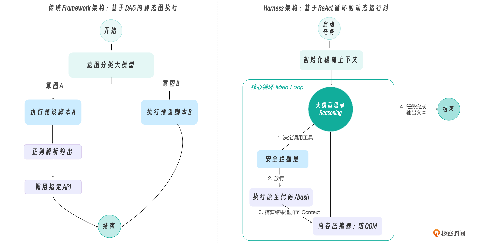
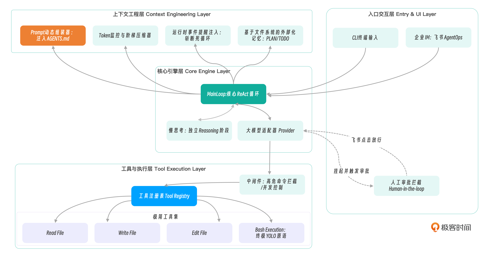
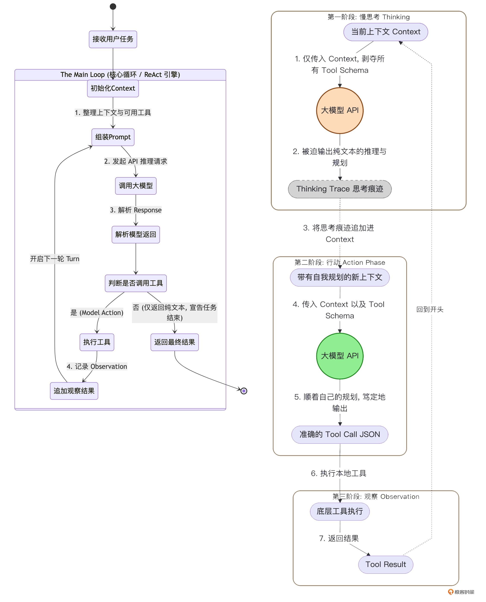
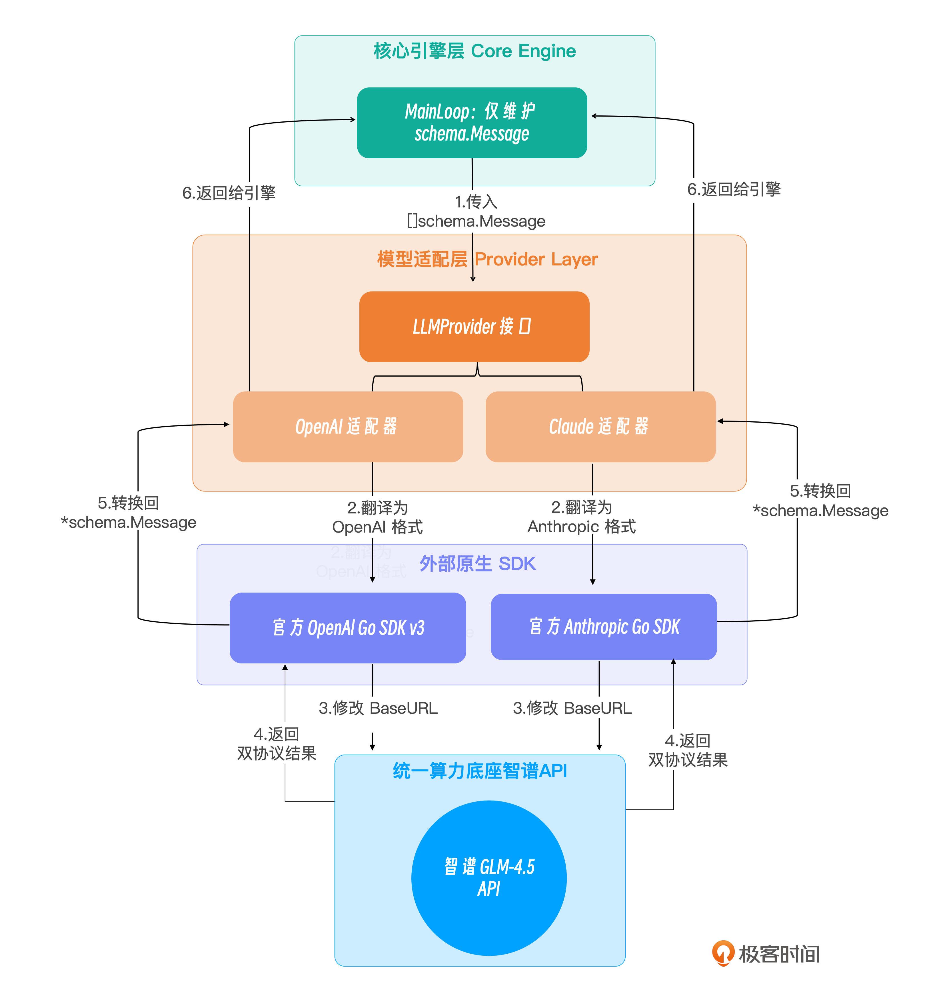
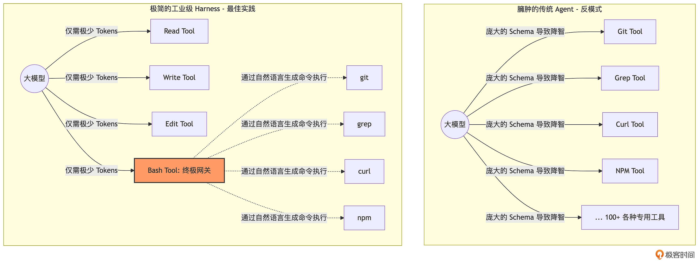
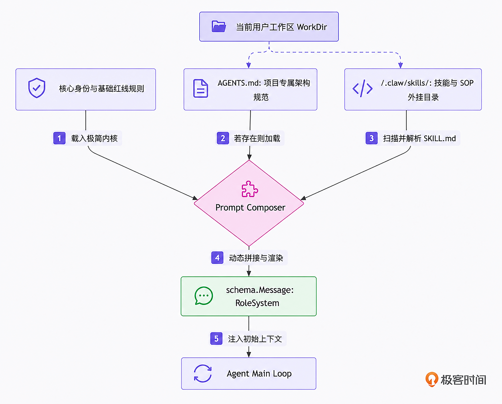
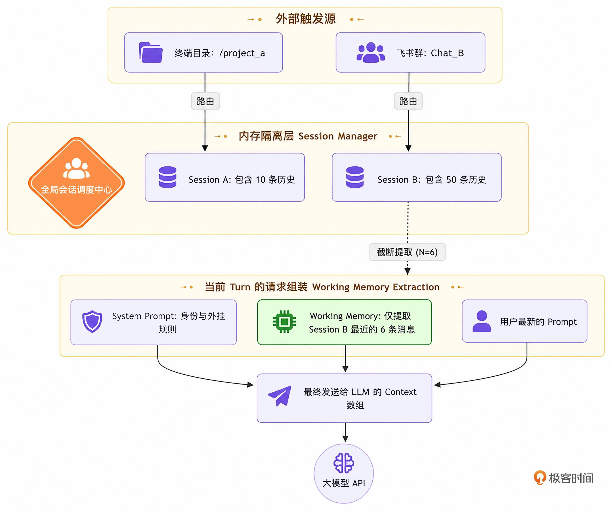
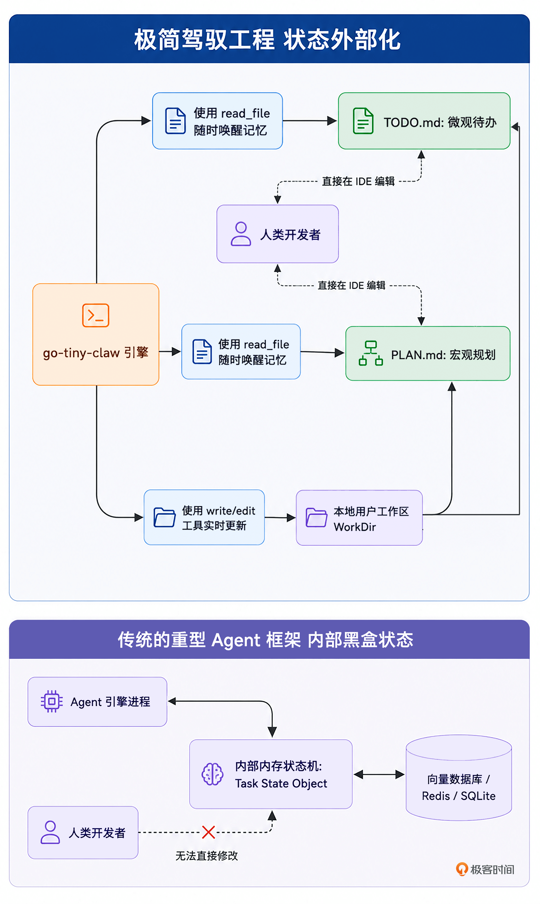
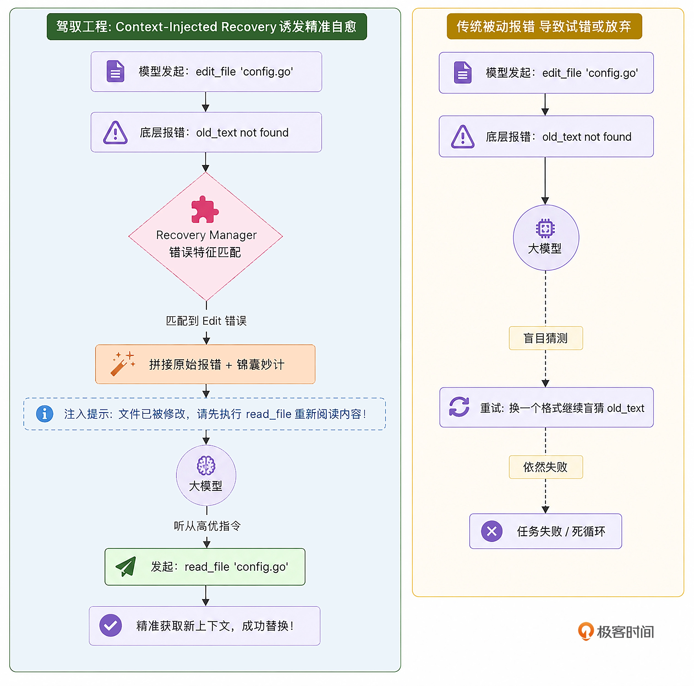
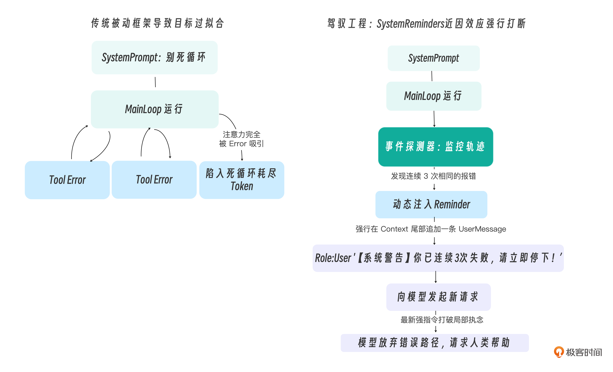

# JavaHarness

用 Java 语言从头写一套 Agent Harness 框架（《从 0 开始构建 Agent Harness》的 Java 移植实现）。

------

# 核心引擎

## Harness 架构

Harness（驾驭工程）：一个无限循环（Main Loop）+ 一组事件驱动的拦截器。

<p align="center">
        
</p>

### 四层架构

<p align="center">
        
</p>

### 项目骨架（Java）

```
src/main/java/com/tinyclaw/
├── ClawApplication.java          # 启动入口，组装各模块
├── model/                        # 领域模型（Message / Role / ToolCall / ToolResult）
├── engine/                       # AgentEngine + Session + Reporter
├── config/                       # AppConfig / ConfigLoader（application.yml）
├── provider/                     # LLMProvider + OpenAICompat + Claude 适配
├── context/                      # PromptComposer / Compactor / RecoveryManager
├── tools/                        # ToolRegistryImpl + ReadFile/WriteFile/EditFile/Bash
├── memory/                       # FileMemoryStore（PLAN.md / TODO.md）
└── feishu/                       # FeishuBot WebSocket 长连接事件分发
```

## ReAct 主循环

### ReAct 循环

ReAct 范式认为，一个真正的智能体，必须像人类解决问题一样，在每次行动前先思考，在每次行动后观察结果：

1. 思考（Reason / Thought）：分析当前拿到的线索，规划下一步的意图。
2. 行动（Act / Action）：向外部环境发出指令，调用工具。
3. 观察（Observe / Observation）：外部环境（比如我们的 Harness 引擎）将工具执行的结果返回给模型。
4. 然后再回到第 1 步，结合新获得的 Observation 再次思考，形成闭环。

### Two-Stage ReAct 循环

但是当工具可用时，模型倾向于迅速采取行动，而不是深入思考。所以可以在底层架构上强制剥离出一个独立的
Thinking（慢思考）阶段，该阶段不告诉模型可以调用的工具，让模型强制思考。

<p align="center">
        
</p>

## 大模型适配器 Provider 接口

抽离 Provider 接口，适配各种不同的大模型厂商

<p align="center">
        
</p>

### 优化方向

在当前的 Provider 适配器中，我们使用的是阻塞式调用，这在 CLI 工具体验中是非常差的。实际生产中，各大模型的 API 均支持
Streaming（流式响应，Server-Sent Events）。如果要把我们的 LLMProvider 改造为支持流式返回的接口，引擎的 Main Loop
该如何优雅地边接收流式字符边打印，同时还能正确拼接出最终完整的 schema.Message 呢？

------

# 极简工具与物理交互

## 工具调用

### 工具注册表 Tool Registry

当大模型决定调用某个工具，并吐出一串 JSON 参数（ToolCall）时，Registry 负责找到对应的函数，把 JSON 丢给它执行，最后将结果封装成统一的
ToolResult 返回给 Main Loop。

在 OpenClaw / pi 的极简哲学中，仅需为大模型提供 4 个基础工具：

1. read：读取文件内容（获取环境信息）。
2. write：创建新文件或完全覆盖文件。
3. edit：精准的局部代码替换（多级模糊匹配）。
4. bash：在当前工作区执行任意 Shell 命令（终极执行器）。

<p align="center">
        
</p>

#### Edit 工具多级模糊匹配

- 级别 1：最快最安全的精确匹配。
- 级别 2：解决不同操作系统（Windows vs Unix）换行符导致的幻觉。
- 级别 3：忽略整个代码块首尾的多余空行。
- 级别 4（核心容错）：将 old_text 和原始文件都按行切分，去掉每一行的首尾空格（消除缩进差异），然后再进行比对。

<p align="center">
        
</p>

### YOLO 哲学

在基础开发阶段，奉行 YOLO 模式：默认全权信任，直接在工作区（WorkDir）中执行。

如果真的出了错，交给 Git 去回滚。

### 并发工具调用

工具调用的顺序和对共享文件的操作会存在冲突。

因此，一个更健壮的 Harness 并发策略可以是：由 Harness 引擎（而非模型本身）在分发 ToolCall
批次时，检查本批次是否全部为只读工具调用。若是，则启用并发；若批次中存在任何写操作，则退化为顺序执行。

> 为使本项目代码尽量简单，所以避开了同时对同一文件进行读写的场景（我们的测试用例均使用安全的、互不干扰的并发读操作）。本项目只保证了工具结果的调用顺序。

### 优化方向

1. 工具调用超时控制
2. 内存溢出保障
3. 常驻后台的进程会阻塞 Agent 线程
4. 并发工具数量控制

## 接入飞书

登录飞书开发者后台 https://open.feishu.cn/app
，具体参考 [09｜飞书集成：打通真实世界，将 go-tiny-claw 接入飞书机器人的事件流](https://time.geekbang.org/column/article/975185?utm_campaign=geektime_search&utm_content=geektime_search&utm_medium=geektime_search&utm_source=geektime_search&utm_term=geektime_search)

注意：这里的飞书官方推荐使用长连接的方式，所以不用内网穿透。

> 具体实现见 FeishuReporter

------

# 上下文工程体系

## 动态加载 AGENTS.md 与外挂 Skills

使得同一套 java-tiny-claw 引擎能在不同语言、不同架构的项目中展现出完美的“入乡随俗”能力。

<p align="center">
        
</p>

一个标准的 Skill 目录结构如下：

```text
my-skill/
├── SKILL.md          # 必填：包含 YAML 元数据与 Markdown 格式的执行指令
├── scripts/          # 选填：技能专属的可执行脚本
├── references/       # 选填：参考文档
└── assets/           # 选填：模板或静态资源
```

### 优化方向

目前是将 skills 一口气全部加载，如何实现“渐进式暴露”？

## 会话 Session 隔离

- 多端并发场景下的 Session（会话）物理隔离。

根据请求的来源（如终端目录哈希、飞书 ChatID、微信 OpenID）分配或唤醒对应的 Session 实例。每个 Session
实例内部维护自己的历史消息队列，并通过读写锁保证并发安全。

<p align="center">
        
</p>

## 上下文压缩策略

物理防御（防止内存溢出 OOM）的优先级，永远高于业务逻辑（短期记忆的完整性）。

我们可以将需要压缩的上下文消息，根据其在对话中的“距离”，施加不同级别的“降级魔法”：

1. System Prompt（系统提示）：永远保留，神圣不可侵犯。
2. 远期历史：超出 Working Memory 保护区的早期对话。在这里，大模型的
   ToolCall（调用了什么工具、传了什么参数）必须保留以维持逻辑链，但是工具执行的返回结果（往往几千字）将被彻底掩码替换（Masking），比如变成一句话：“…[为了节省内存，早期的工具输出已被系统清理。原始长度: 15000 字节]…”。
3. Working Memory（短期工作记忆）：最近的N轮对话。我们期望它是完整的。但如果其中单条工具输出实在太长（比如超过了 1000
   字符），哪怕它处于保护区内，我们也必须触发掐头去尾截断法（Head-Tail Truncation），仅保留前 500 字和后 500
   字。因为对于报错日志来说，开头说明了错因，结尾通常带有堆栈总结，中间的无尽循环完全可以抛弃。

<p align="center">
        
</p>

## 持久化记忆

当你给 Agent 下达一个宏大的长程任务，这个任务可能会跨越几个小时，经历上百个 Turn 的 ReAct 循环。由于我们的 Compactor
会不断地将早期历史压缩（甚至彻底掩码），大模型很快就会产生严重的长程失忆症。

在顶级 Coding Agent 的极简哲学中，一切长程任务的追踪都可以通过引导 Agent 读写两个约定俗成的文件来完成：

- PLAN.md：用于存放宏大的架构设计、重构思路和全局约束。
- TODO.md：用于存放细颗粒度的待办事项列表（Checklist）和当前进度状态。

<p align="center">
        
</p>

## 错误自愈 Error Recovery

当工具调用失败时，仅仅返回原始的 Error Log 是远远不够的。必须基于当前的工具和错误类型，向 Context 中注入带有强烈倾向性的恢复建议。

<p align="center">
        
</p>

### 优化方向

自定义一套严谨的领域错误码（抛出自定义异常）

------

# 稳定性控制与多智能体

## System Reminders 防死循环

大模型即使配备了 Error Recovery，仍会陷入 **Doom Loop（死循环）／Exploration Spiral（探索螺旋）**——连续用相同参数反复重试一个已失败的操作。

在每轮 LLM 推理的前一刻，将高优先级引导指令**伪装成最新一条 User Message**注入上下文最末端。

**ReminderInjector**（`engine/ReminderInjector.java`）：

| 条件            | 行为                                              |
|---------------|-------------------------------------------------|
| 工具执行成功        | 清空所有失败计数器（Agent 已找到正确路径）                        |
| 工具执行失败        | 指纹累加，`Map.merge()` 线程安全                         |
| 连续 ≥3 次相同指纹失败 | 以 `Role.USER` 注入 `[SYSTEM REMINDER 警告]`（最高近因权重） |

<p align="center">
        
</p>

### 优化方向

精确参数哈希会被模型的"小聪明"绕过（路径尾部加空格、改用相对路径等），后续可引入参数正则化预处理来提升泛化匹配能力。
